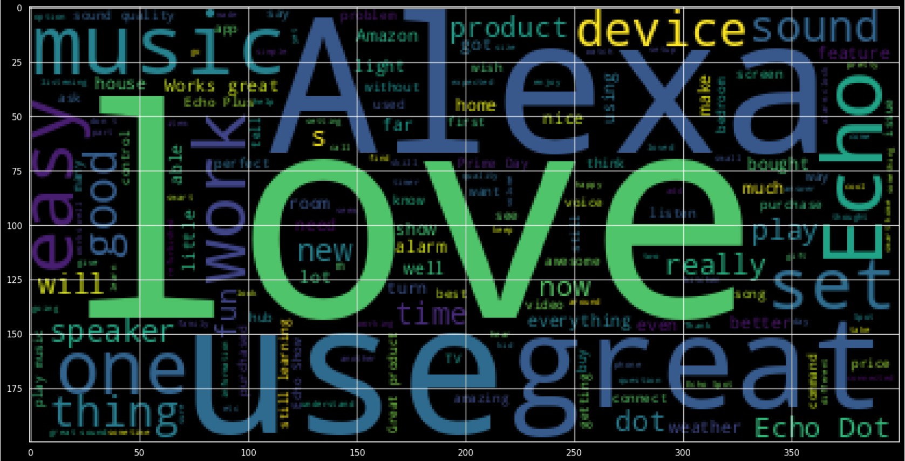
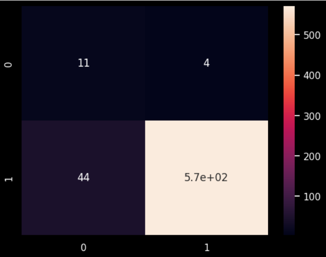
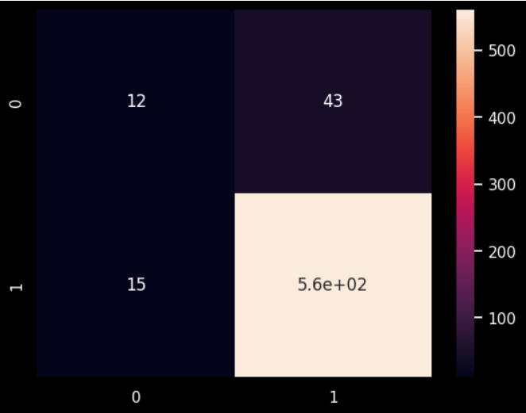
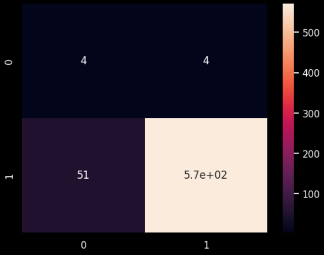
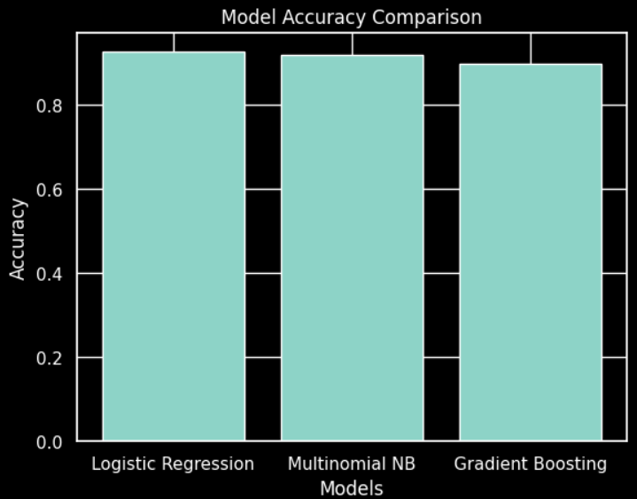

# 🧠 Sentiment Analysis on Amazon Reviews

## 📌 Project Overview
This project focuses on building, training, testing, and evaluating machine learning models to predict customer sentiment from real Amazon Echo reviews.  
The objective is to classify reviews as **positive (1)** or **negative (0)** using Natural Language Processing (NLP) and Machine Learning techniques.

## 🎯 Objective
- Build an AI-based sentiment analysis system
- Perform exploratory data analysis (EDA)
- Visualize important patterns in the data
- Train and compare multiple ML models
- Evaluate model performance

## 🛠️ Tools & Technologies
- Python
- Anaconda
- Scikit-learn
- Matplotlib
- Seaborn
- Jupyter Notebook

## 📂 Dataset
- **Dataset:** Amazon Echo Reviews  
- **Source:** Kaggle  
- **Input:** Customer review text  
- **Output:** Sentiment label  
  - `1` → Positive  
  - `0` → Negative  

## 🔍 Project Workflow

### 1️⃣ Data Preprocessing
- Text cleaning (lowercasing, punctuation removal)
- Stopword removal
- Tokenization
- Vectorization using CountVectorizer / TF-IDF

### 2️⃣ Exploratory Data Analysis (EDA)
- Sentiment distribution analysis
- Review length analysis
- Word frequency analysis
- WordCloud visualization
- Identification of top frequent words

### 3️⃣ Machine Learning Models Used
- Logistic Regression
- Multinomial Naive Bayes
- Gradient Boosting Classifier

## 📊 Model Results

### 🔹 Logistic Regression

### 🔹 Multinomial Naive Bayes

### 🔹 Gradient Boosting Classifier

## 🏆 Conclusion
- All models successfully classified sentiment from Amazon reviews
- Logistic Regression achieved the best overall performance
- The project demonstrates how ML can automate large-scale customer feedback analysis

## 🌍 Real-World Application
- Customer feedback monitoring
- Product improvement analysis
- Automated review classification
- Business decision support systems

  
## 🔹 Model Accuracy Comparison

